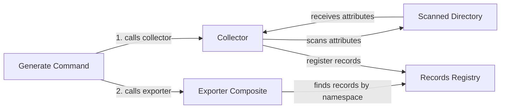

# Flowchart PHP

Flowchart PHP is a proof of concept tool that allows you to generate explanatory diagrams directly from your PHP source code. \
This tool is designed to improve the documentation for your application and help users better understand component interactions in large codebases. \
With Flowchart PHP, you can quickly and easily create diagrams that illustrate the flow of your code, making it easier to understand and debug. \
Whether you're a developer working on a complex application or a technical writer looking for a better way to explain complex concepts, Flowchart PHP can help you create clear, concise, and visually appealing diagrams that will enhance your documentation and improve the overall user experience. 

### Requirements

1. php >= 8.1
2. nodejs
3. puppeteer along with chrome
4. mmdc for node

### Demo

<video src="./docs/media/flowchart_demo.mp4" width=550 controls="controls"></video>

### Usage
Use PHP attributes to mark your code with nodes and their links withing chart namespace to describe interaction
```php
#[
    \Flowchart\Node('collector', 'Collector'),
    \Flowchart\Node('scannedDir', 'Scanned Directory'),
    \Flowchart\Link('collector', 'scannedDir', 'scans attributes'),
    \Flowchart\Link('scannedDir', 'collector', 'receives attributes'),
    \Flowchart\Link('collector', 'registry', 'register records')
]
class Collector
```

Define root chart namespaces configs and/or dedicated configuration by placing `.flowchart.json` file chart namespace root folder.\
Specify chart exports config for given folder tree.\
Use `destination -> exporter type`\
```json
{
  "namespace": "FlowchartGlobal",
  "exports": {
    "./../README.md": "md",
    "customFile.txt": "text",
    "FlowchartGlobal.png": "png"
  }
}
```

Currently, the app supports:
- generating raw text file that can be visualized at https://mermaid.live/edit
- generating png files (node `mmcd` along with `puppeteer` packages required)
- injecting source text into `.md` files via specifying `%%[CHART_NAMESPACE]`
- more exporters for Confluence, Wiki etc. are coming soon.

The package can be extended with custom exporters to provide more flexible usage

### Generate charts for own codebase
```
bin/flowchart generate ./src
```

### Generate output images via JS from collected mermaid charts
```
mmdc -i ./src/FlowchartGlobal.mmd -o out.png -p puppeteerConfigFile.json
```

### Mermaid chart example that was injected automatically into this readme.md 

